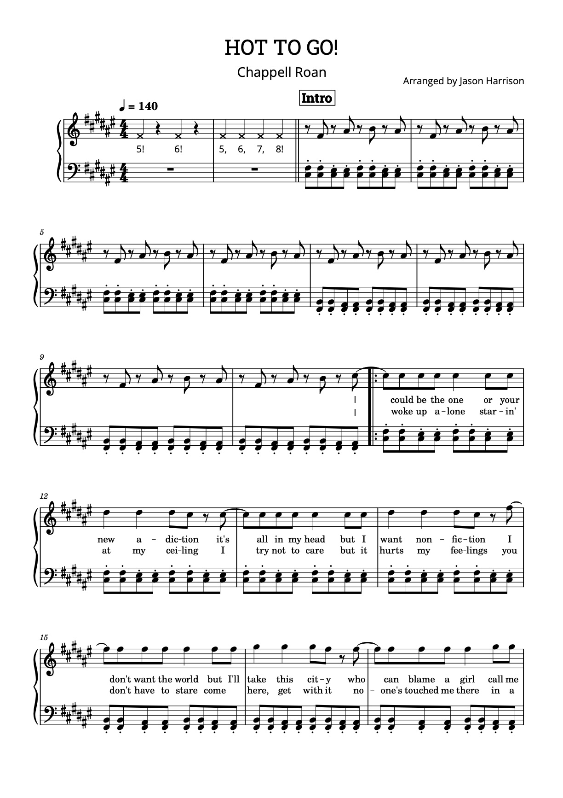
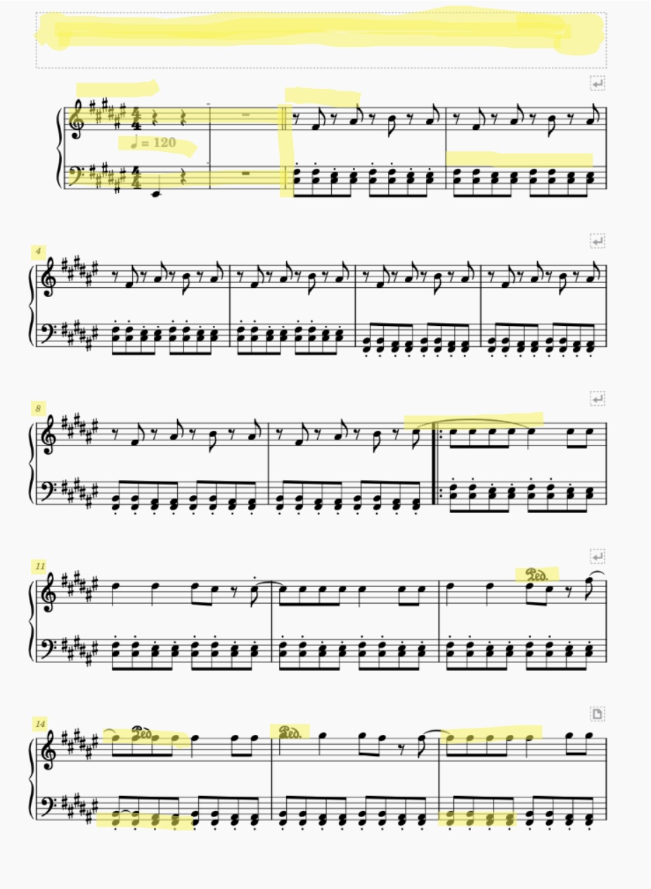

# 2557519c MUSIC CURATION AND ANALYTICS PORTFOLIO

  

# WEEK 1: BASICS OF MUSIC DATA

TASK 2: IDENTIFY A THEME FOR YOUR DATASET

For my dataset collection I am choosing the song 'Hot To GO!' released by Chappell Roan on the 11th August 2023, featuring on her debut studio album The Rise and Fall of a Midwest Princess (2023). Maimn Themes presented:

Pop music
New Digital Age (Social media)
Chappell Roan is a name and persona adopted by singer-songwrite Kayleigh Rose Amstutz. Roan is known for her theatrical, camp, and bold stage presence brought when performing her uniquw blend of pop, rock and indie sounds of music. My reasoning for choosing 'Hot To Go!' of all the songs on her discography is for its specific erruption of popularity online. This song was one of the first to bolster Roan's career through social media trends. The song has an accompanying dance Roan teaches her audiences in person at shows, and this dance is now deeply rooted in people's associations of the song even without attendance to the show through her music video and fans recodrings of concerts being shared online. I think it is very current in regards to the evolution of music data and will present new, or modern, manifestations of music data; exploring how the ever-progressing digital age is expanding the scope in defining music data, how it is collected, and further understood.

TASK 3: CHALLENGES OF WORKING WITH MUSIC DATA

GENERAL CHALLENGES:

licensing and copyright restrictions
varying qualities and formats of data
technical complexities/ challenges in attaining or disseminating files
monetary restriction
'HOT TO GO!' CHALLENGES:

The cuiltural influence extends beyond traditional music metrics like sales and streaming numbers - hard to measure these data frameworks and engagements, so risk of inconsistant or inaccurate descriptive data
There is a decentralised approach to interaction as much of the popularity is produced through User Generated Content (UGC) so Notated, acoustic and descriptive data used may not come from the direct source of the artist.
with copyright and licensing protections in place, being a recently released pop song, access to notated and acoustic data will likely cost money
CURENT MANIFESTATIONS OF DATA RELATING TO MY THEME

DESCRIPTIVE DATA

Descriptive data surrounding my chosen song can be found on multiple streaming platforms such as YouTube, Spotify, ITunes etc., providing information on length of song, title, lyrics, number of streams, date of release, liscensing, and so on. Additionally, the song has a Wikipedia page detailing similar information such as the songs producers and label. The Wikipedia page also offers background information into the writing process, composition and critical response of the song. Descriptive data can additionally include more descriptive metadata in the notated data including time scores, and keys.

NOTATED DATA

Notated formats of Data can be found on multiplke sheet music platforms online. For my project, I am purchasing an arrangement curated by ??, found and purchased on Musescore.com. However, there is a vast availability of notated data online with other websites including ultimate-guitar.com, as well as videos on social platforms such as Youtube and Tiktok displaying arrangements alongside a guided tutorial on how to play a cover of the song.

ACOUSTIC DATA

The original studio recording of 'Hot To Go!' is available on popular streaming platforms. Additionally, the music video for the song is available on YouTube. However, due to the songs popularity there are many live recordings of the song available online. Some of them are officially recorded and disseminated covers of the song by Chappell Roan, such as with her TinyDesk performance available om YouTube. However, there are also a number of recordings available to watch online of Chappell Roan's live performances of the song. There are also many TikTok videos made using the audio. The extent of acoustic data available of the song, mostly in, but not limited to, the format of live recordings, highlights the shift of the digital age and the impact of social media in the dissemination of acoustic data. For my project however, I will be purchasing the original studio recordnig of the song in ??MP3 file format??

  

# WEEK 2: TRANSCRIBING AND EDITING SHEET MUSIC

Below I have provided first, the original sheet music. Followed by how MuseScore converted it (Highlighting where there were errors).  

Errors include:
 - Missing text at top (song title, artist, music arranger)
 - Incorrect placement of and tempo marking above bar 1 
 - Incorrect bar count
 - Missing 'INTRO' direction
 - Incorrect bar count
 - Incorrect Bar line at beginning of bar 3
 - Unnecessary inclusion of pedal marks on bars 13, 14 and 15
 - Exclusion of lyrics
 - missing all note in bars 1 and 2
 - Elongated tie linking notes on bar 10-11
 - Incorrect placement of notes on bars on the bottom line

Potential impacts:
 - As discussed in our group laboratory on Tuesday, errors in incorrect OMR engine transcription can cause multiple issues.
   
 - Overall, I would argue, my chosen piece was predominantly successful in transposing the music accurately. However, in saying that, the errors spotted still completely affect the sound of the music.
   
 - Similar issues we encountered in the group and individual lab was the tempo either not showing up or being incorrect, this would result in the rhythm of the music being off, thus making it difficult to perform correctly.
   
 - Similarly there were errors in the alignment of notes and bar-lines. This     completely affects the readability of the score and would account for a completely different reading and sound.

Additional impacts that may be experienced from inaccurate OMR scannings may include:
 - confusion with slurs, ties and ligatures in notation
 - incorrect and missin accidentals altering sound of music
 - Incorrect time signatures of keys, completely altering tonality and ability to perform a piece

# WEEK 3: ENCODING BASICS FOR NOTATION

For this weeks task we compared and analysed the difference in a MusicXML file, with an MEI file-type. Some comparissons I noticed.

<b>NOTE ELEMENT:</b> This parent element, included in both MusicXML and MEI, includes, again in both softwares, the duration, pitch, stem directions and articulations or accidentals. This provides basic representations of an individual note of music, making it translatable. MEI however provides more detailed descriptions such as with accidentals it details if it is a visual (accid.vis) or gestural (accid.ges) accidental. Additionally including more information inside this element such as fingerings, annotations, and apparatus, which MusicXML either does not include, or encodes, but seperately from the element of the note. These differences can affect the ease of readability for users, and alter their understanding of a piece of music. In lacking detail, the readers comprehension will be weaker.

<b>MEASURE ELEMENT:</b>This element is again present in both MusicXML and MEI. This element contains all music contents that fall within one bar of music. One stark difference is that the same measure element falls across 100 lines in MEI versus 333 lines on MusicXML. I would argue MEI provides a more concise and easilt interpratable set of data, as eveything that relates to once note is neatly fixed on one line, rather than multiple with MusicXML. Withing this element however, both contain the same basic element within such as notes (and everything internal to that), breaks, and attributes. Again, in this instance, MEI provides more thorough information including (specifically in the case of my code) the detailing of beamed notes using a beam element, allowing for detailed control over the visual appearance, duration and rhythmic grouping of notes which MusicXML failed to include.

<b>SCOREDEF VS PART-LIST:</b> One key difference i noticed is in the metadata provided at the beginning of the sheetmusic. This is the way in which the information on the song title, composer, instrumetn etc is provided. Music XML divides this into two sections; 'The Credit' element (including title, artist, composer) and then the 'score-part' follows, providing pitch, tempo, instruments etc. MEI provides all this information in the one parent element 'scoredef'. This section can be referred to as the score header, the first group of elements containing metadata on the music; premature to the music data which contains the actual music. In this case, both softwares are providing near enough the same information, just in different presentations, in doing so, the user is attaining the same amount of information, thus comprehension of the music. However, file format can still impact things such as computer recognition and file size and performance.

# WEEK 4: COMPUTATIONAL ANALYTICS OF NOTATED MUSIC

The features I analysed and their jSymbolic analysis: 

- RANGE: 38
  
Difference in semitones between the highest and lowest pitches.

  
- MEAN PITCH: 54
  
Mean MIDI pitch value, averaged across all pitched notes in the piece. 
  
- NUMBER OF COMMON PITCH CLASSES: 2
  
Number of pitch classes that account individually for at least 20% of all notes. Enharmonic equivalents are grouped together for the purpose of this calculation.

- LAST PITCH: 80
  
The MIDI pitch value of the last note in the piece. If there are multiple notes with simultaneous attacks at the end of the piece, then the one with the lowest pitch is selected. Set to 0 if there are no pitched notes.
  
- MOST COMMON RHYTHMIC VALUE: 0.25
  
The most common rhythmic value of the music, in quarter note units. So, for example, a Most Common Rhythmic Value of 0.5 would mean that eighth notes occur more frequently than any other rhythmic value. This calculation includes both pitched and unpitched notes, is calculated after rhythmic quantization, is not influenced by tempo, and is calculated without regard to the dynamics, voice or instrument of any given note.

# WEEK 5: STANDARDS IN CURATION

This week we are investigating the importance of detailed metadata in order to understand what is contained within an MEI file. 
Below is a metadata schema including data I feel is particularly relevant to be included. 

<table>
 <tr>
 <th>Metadata Element</th>
 <th>Use</th>
 <th>Relevance of inclusion</th>
 </tr>

 <tr>
  <td>Title</td>
  <td>dislays the name of the chosen song.</td>
  <td>Ensures this version is not confused with a song of the same name.</td>
 </tr>

  <tr>
  <td>Artist</td>
   <td>displays the name of the person performing.</td>
   <td>Edsures the correct singer/ performer is identified.</td>
 </tr

  <tr>
  <td>Publisher</td>
  <td>displays the name of the person/ company that published the song.</td>
   <td>Ensures the correct release/ version of the song is identified. Provides inisight into publication of the song/ a labels's history.</td>
  </tr>

 <tr>
  <td>(sub)Genre</td>
  <td>displays the genre of the song.</td>
  <td>Ensures the tone and context of a song is understood</td>
 </tr>

  <tr>
  <td>Album</td>
   <td> displasy the name of the album which the song was released in.</td>
   <td>Ensures the correct version of a song is referenced.</td>
 </tr>

 <tr>
  <td>Duration</td>
   <td> displasy the length of the song.</td>
   <td>Ensures the correct version of a song is referenced. Allows comparisons to different versions/ covers of the song.</td>
 </tr>

 
</table>

# WEEK 7: CREATIVE COMMONS LICENSING

<b>Part 1: Choosing a creative Commons License </b>

My chosen Licensing Attributtion is <b>CC BY-NC 4.0</b>

Terms of the Creative Commons LicenseL:
1. <u>Attribution</u> - You must give appropriate credit, provide link to the license, and indicate if changes were made; ensuring not to suggest the licenser endorsed your use.
2. <u>NonCommercial</u> - You may not use the material for commercial purposes

This Creatie Commons lience allows you to do the following things, as long as you follow license terms
1. <u>Share</u> - copy and redistribute the material in any medium or format
2. <u>Adapt</u> - Remix, transform and build upon material

The CC BY-NC (Creative Commons Attribution-NonCommercial) license allows creators to share their work freely as long as they are credited and it’s not used for commercial purposes. As 'Hot To Go!' recieved its popularity through its manipulation and manifestation online, this license is ideal as it encourages public sharing, or personal projects while restricting profit-driven applications. Compared to more permissive licenses like CC BY or CC BY-SA, which allow for commercial use, CC BY-NC provides greater control over how the work is monetized. Therefore, the song can be used and shared,furthering its popularity, but ensures only approrprate sources are monetizing from the source. Unlike other licenses such as the CC BY-ND, which prohibits changes, CC BY-NC continues to allow others to adapt or remix the work, fostering creative innovation as long as it remains noncommercial. This balance makes CC BY-NC a popular choice for creators aiming to support open access with non-commercial protections. These factors I think are crucial in abiding to the new digital age in which music attains and gains popularity through its online relevance, hindering the ability to allow for sharing would go against this phenomenon and potentially depleat its relevance.

<b>Part 2: Formatting Metadata</b>

Currently my Metadata is displayed in a large chunk of text at the top of my Verivo score with no punctuation, and no description of what means what. Thus, in terms of formatting, I would give the metadata subtitles such as: 

Song: 'Hot To Go!'

Album: The Rise and Fall of a Midwestern Princess

Artist: Chappell Roan

Song length: 3 minutes 4 seconds...

In doing so, it would ensure the clarity of the metadata's meaning, optimizing its relevance and use. 

